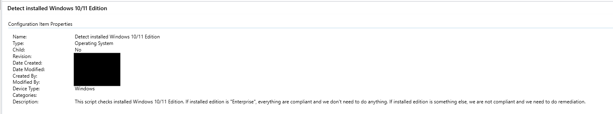
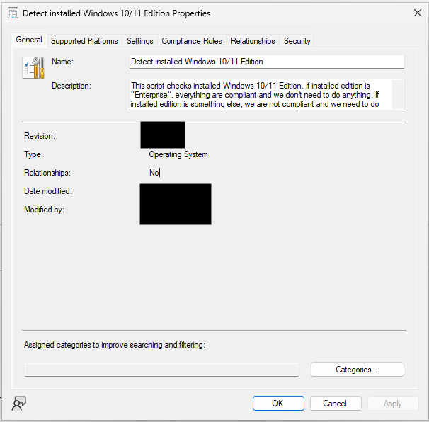
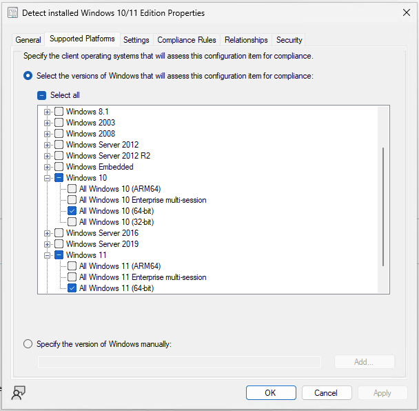
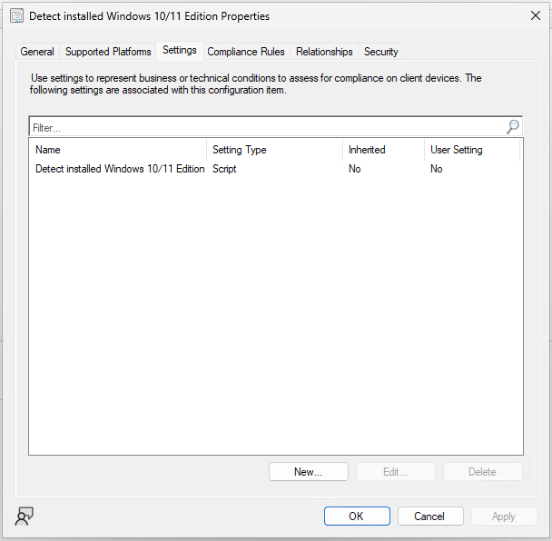
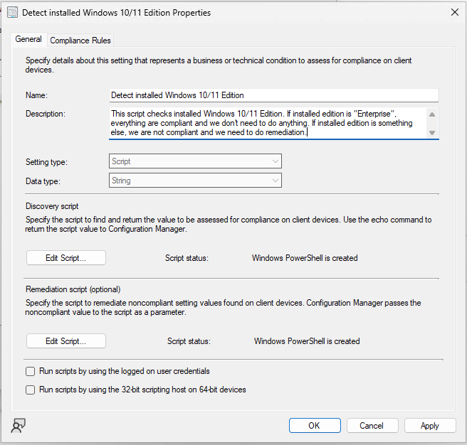

# Edition Upgrade to Windows 10/11 Enterprise via KMS
If you came across situation where your KMS-activated Windows 10/11 Enterprise have been somhow downgraded to e.g. Windows 10/11 Pro, this script is for you!
This script upgrade your company-managed device back to KMS-activated Windows 10/11 Enterprise silently without any user interruption.

## Screenshots for Configuration Manager deployments
Here are the screenshots, that are helpful when deploying these to Configuration Manager.

### Configuration Items

## Configuration Baselines
